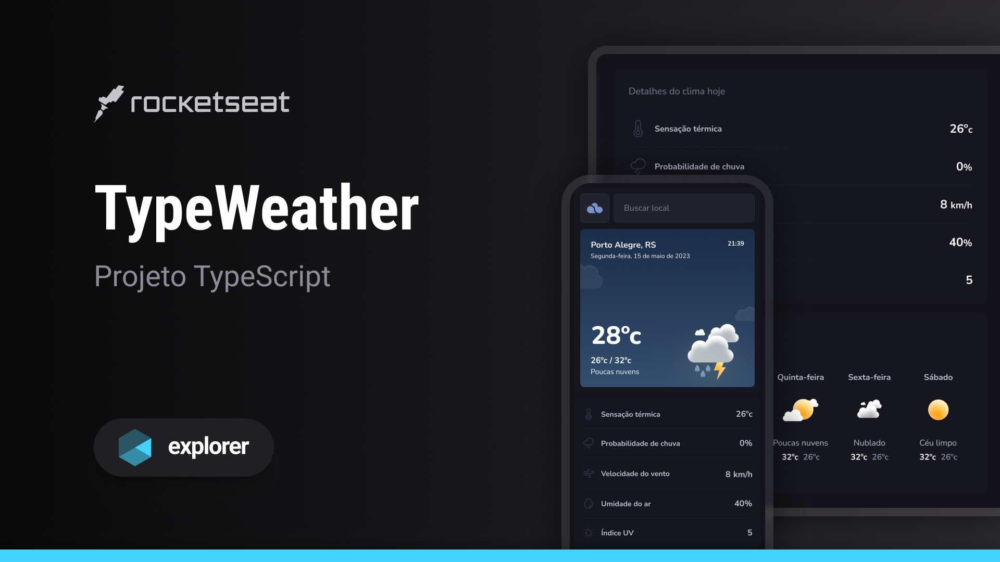

<h1>TypeWeather</h1>

 

  

 

<h2> Sumário </h2>

1. [Avisos](#avisos)
2. [Sobre](#sobre)
3. [Funcionalidades](#funcionalidades)
4. [Tecnologias, Bibliotecas e Ferramentas](#tecnologias-bibliotecas-e-ferramentas)
5. [Autor](#autor)

## Avisos
**IMPORTANTE: O frontend e o backend da aplicação estão finalizados.**

- Projeto desenvolvido pela @rocketseat.

- Você pode clonar o repositório e executar a aplicação localmente.

## Sobre
O projeto foi desenvolvido como um pequeno curso bonus do programa [Explorer da Rocketseat](https://www.rocketseat.com.br/explorer). Ele segue a ideia de uma aplicação de clima tempo interativo, onde o usuário poderá pesquisar por cidades e ter como retorno as informações do clima das mesmas.

A aplicação foi toda desenvolvida inicialmente utilizando javascript e ao longo das aulas implementamos o TypeScript. O foco da aplicação foi o ensino do TypeScript na prática. 

Foi aprendido:
- Definição de tipagens;
- Utilização de tipos primitivos como números, strings e booleanos;
- Criação de tipos personalizados;
- Como tipar objetos e componentes, utilizando tanto interfaces quanto types.

### Deploy

Quer conferir o TypeWeather? [Visite o projeto online.](https://typeweatherclimate.netlify.app/)

## Funcionalidades

- **Usuário**: 
  - Pode Fazer a busca pelo nome da cidade;
    - Feito através da campo de pesquisa.
  - Visualiza as informações do clima da cidade;
  
 

## Tecnologias, Bibliotecas e Ferramentas

Foram utilizadas as seguintes tecnologias, bibliotecas e ferramentas para o desenvolvimento do frontend desse projeto:

- **API** - foi utilizado uma api gratuita externa do OpenWeather
- **JavaScript** - Faz toda a lógica da aplicação;
- **TypeScript** - Usado para construir as interfaces;
  - **NPM** - Realiza a instalação das dependências;
  - **Vite** - Usado para criar o projeto React;
  - **Styled-Components** - Faz a estilização da aplicação;
  - **Axios** - Utilizado para fazer as requisições.
  - **Deploy com netlify** - Utilizando a plataforma do netlify para fazer a hospedagem do frontend;
- **Git** - Responsável por realizar o gerenciamento de versionamento do código;
- **GitHub** - Utilizado para armazenar a aplicação em nuvem.

## Autor
Desenvolvido por [Rocketseat](https://www.rocketseat.com.br/). :rocket: